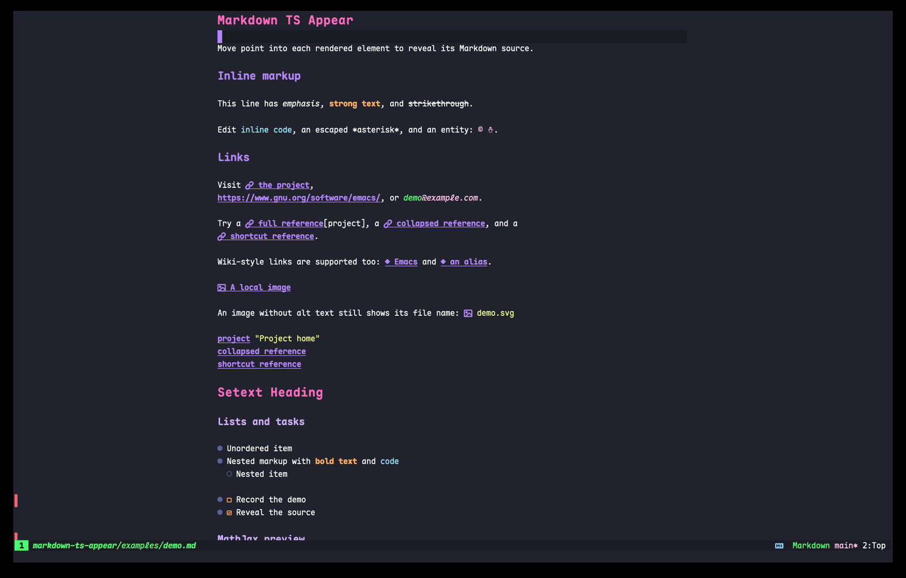

#+title: markdown-ts-appear

#+begin_center
Rendered while reading. Source when editing.
#+end_center

[[https://github.com/Thysrael/markdown-ts-appear/actions/workflows/ci.yml][file:https://img.shields.io/github/actions/workflow/status/Thysrael/markdown-ts-appear/ci.yml?branch=main&style=for-the-badge&logo=githubactions&logoColor=white&label=build#.svg]]
[[https://github.com/Thysrael/markdown-ts-appear/releases/latest][file:https://img.shields.io/github/v/release/Thysrael/markdown-ts-appear?display_name=tag&sort=semver&style=for-the-badge&logo=github&logoColor=white#.svg]]
[[https://www.gnu.org/software/emacs/][file:https://img.shields.io/badge/Emacs-31.1%2B-7F5AB6?style=for-the-badge&logo=gnuemacs&logoColor=white#.svg]]
[[file:COPYING][file:https://img.shields.io/badge/license-GPL--3.0-green.svg?style=for-the-badge&logo=opensourceinitiative&logoColor=white#.svg]]

Reveal the source of the rendered Markdown element at point in Emacs'
built-in ~markdown-ts-mode~.  Optionally, LaTeX fragments can be rendered
asynchronously with MathJax while they are not being edited.

* Requirements

- Emacs 31.1 or newer
- The ~markdown~ and ~markdown-inline~ Tree-sitter grammars

Math preview is disabled by default.  It additionally requires the optional
~mathjax~ Emacs package and Node.js, neither of which is installed by this
package.  Preview is attempted only in a graphical SVG-capable session.

CI tests both the latest Markdown grammar and commit
~413285231ce8fa8b11e7074bbe265b48aa7277f9~ as a reproducible baseline.
Most matrix jobs intentionally run without ~mathjax~; one installs it and
performs a real MathJax-to-SVG render.  CI also runs weekly against Emacs
snapshot and checks the calling conventions of every private ~markdown-ts-mode~
function used by the package, so upstream API changes fail CI even when this
repository has received no new commits.

* Installation

With ~use-package~ and ~package-vc~:

#+begin_src emacs-lisp
(use-package markdown-ts-appear
  :vc (markdown-ts-appear
       :url "https://github.com/Thysrael/markdown-ts-appear"
       :rev :newest)
  :hook (markdown-ts-mode . markdown-ts-appear-mode))
#+end_src

Markup is hidden automatically and the smallest semantic element at point is
revealed.  Images without alt text keep their file name visible.  Visual
decorations are opt-in, so links, fenced code blocks, block quotes, and pipe
tables retain their normal ~markdown-ts-mode~ appearance by default.  Wiki
links such as ~[[target|alias]]~ are supported with the grammar's default
configuration.

* Visual Decorations

Decoration values are plain strings and do not require an icon package.  A
cons cell selects its first string when every character is displayable and its
fallback otherwise.  For example:

#+begin_src emacs-lisp
(setq markdown-ts-appear-link-icon '("" . "↗")
      markdown-ts-appear-image-icon '("" . "▧")
      markdown-ts-appear-code-fence-marker "▣"
      markdown-ts-appear-block-quote-open-marker "❝"
      markdown-ts-appear-table-style 'unicode)
#+end_src

These strings can instead use characters supplied by your preferred font.
The package does not depend on ~nerd-icons~ or choose a font for you.  Emacs 31
also provides ~icons.el~, but it has no generic link or image icon and its
image-backed strings are not used as portable text fallbacks here.
Re-enable ~markdown-ts-appear-mode~ after changing structural decoration
options in an active buffer.

* Math Preview

Install and opt into the optional MathJax integration separately:

#+begin_src emacs-lisp
(use-package mathjax
  :ensure t
  :defer t)

(setq markdown-ts-appear-enable-math-preview t)
#+end_src

If the option is enabled without ~mathjax~, the main appear mode remains active
and reports that math preview is unavailable.  Re-enable the main mode after
installing ~mathjax~ or changing this option.

To render image files themselves, also enable the built-in
~markdown-ts-inline-images~ option or run ~markdown-ts-toggle-inline-images~.

* Evil

Evil is optional.  To reveal source only while editing:

#+begin_src emacs-lisp
(setq markdown-ts-appear-trigger 'evil-insert)
#+end_src

* Options

- ~markdown-ts-appear-trigger~ controls when source is revealed.
- ~markdown-ts-appear-enable-math-preview~ enables MathJax previews and defaults
  to nil.
- ~markdown-ts-appear-math-timeout~ controls rendering timeouts.
- ~markdown-ts-appear-center-display-math~ controls display math alignment.
- ~markdown-ts-appear-math-scale~ controls formula size and defaults to ~1.1~.
- ~markdown-ts-appear-link-icon~, ~markdown-ts-appear-image-icon~, and
  ~markdown-ts-appear-wikilink-icon~ control link prefix icons and default to
  nil.
- ~markdown-ts-appear-code-fence-marker~ controls rendered fence markers and
  defaults to nil.
- ~markdown-ts-appear-code-fence-show-closing-marker~ controls whether closing
  fences reuse that marker and defaults to nil.
- ~markdown-ts-appear-block-quote-open-marker~ controls the opening quotation
  mark and defaults to nil.
- ~markdown-ts-appear-table-style~ is either ~raw~ or ~unicode~ and defaults to
  ~raw~.  The Unicode style replaces existing pipe-table delimiters without
  adding or aligning borders.

* Demo

Open [[file:examples/demo.md][examples/demo.md]] in ~markdown-ts-mode~ to exercise headings, inline markup,
links, images, lists, tasks, tables, MathJax previews, and other revealable
elements.  Math examples use the delimiters supported by the Markdown grammar:
~$...$~ and ~$$...$$~.  The local SVG keeps the image example independent of
the network.

* Development

Run the tests with:

#+begin_src shell
MARKDOWN_TS_APPEAR_REQUIRE_GRAMMARS=1 \
emacs --batch -Q -L . \
  --eval '(progn (require (quote package)) (package-initialize))' \
  -l test/markdown-ts-appear-test.el \
  -f ert-run-tests-batch-and-exit
#+end_src

Without ~MARKDOWN_TS_APPEAR_REQUIRE_GRAMMARS~, tests that require the Markdown
Tree-sitter grammars are skipped when the grammars are unavailable.  To also
require the optional package, Node.js, and a real MathJax-to-SVG render, add
~MARKDOWN_TS_APPEAR_REQUIRE_MATHJAX=1~ before the command.

* License

GNU General Public License version 3 or later.  See [[file:COPYING][COPYING]].
